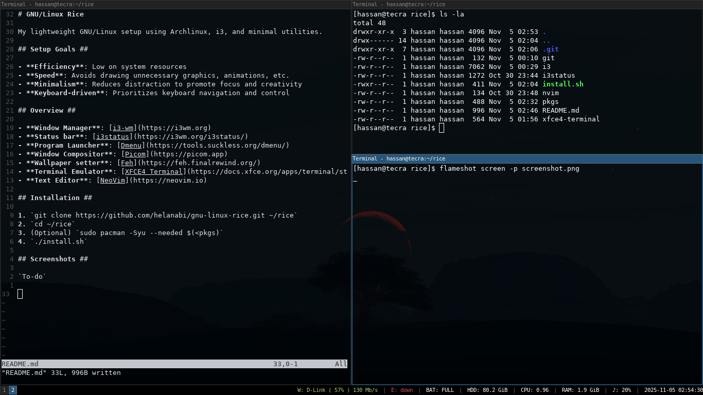

# GNU/Linux Rice

My lightweight GNU/Linux setup using Archlinux, i3, and minimal utilities.

## Setup Goals ##

- **Efficiency**: Low on system resources
- **Speed**: Avoids drawing unnecessary graphics, animations, etc.
- **Minimalism**: Reduces distraction to promote focus and creativity
- **Keyboard-driven**: Prioritizes keyboard navigation and control

## Overview ##

- Window Manager: [i3-wm](https://i3wm.org)
- Status bar: [i3status](https://i3wm.org/i3status/)
- Program Launcher: [Dmenu](https://tools.suckless.org/dmenu/)
- Window Compositor: [Picom](https://picom.app)
- Wallpaper setter: [Feh](https://feh.finalrewind.org/)
- Terminal Emulator: [XFCE4 Terminal](https://docs.xfce.org/apps/terminal/start)
- Text Editors: [GNU Emacs](https://www.gnu.org/software/emacs/), [NeoVim](https://neovim.io)

## Requirements ##

- `Git`: for cloning this repository.
- `Sudo`: for applying system-wide configuration.

## Installation ##

1. `git clone https://github.com/helanabi/gnu-linux-rice.git ~/rice`
2. `cd ~/rice`
3. (As root) `cp sudo /etc/sudoers.d/hassan`
4. `./install.sh`

## Screenshot ##

